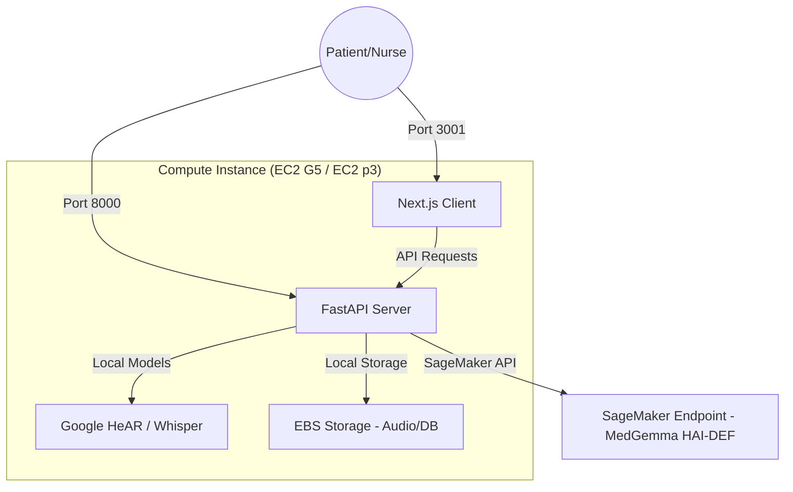
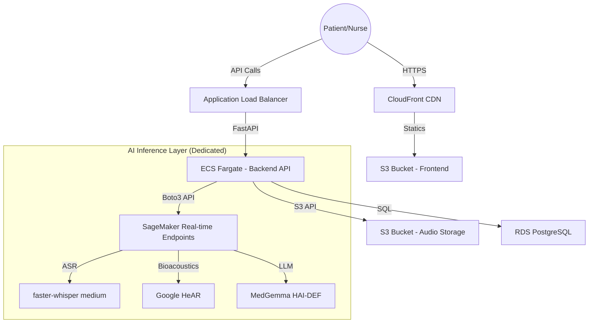

# ☁️ AWS Deployment Plan: VaidyaSaarathi

This plan outlines the migration of the VaidyaSaarathi Agentic Triage system from a local prototype to a production-ready AWS environment.

## 🏗️ Architecture Options

### A. Prototype Architecture (Recommended for Hackathon)
Keep the frontend and backend on one EC2 instance but offload the **HAI-DEF MedGemma** model to a dedicated **SageMaker Endpoint** for reliable inference.

### B. Production Architecture (Enterprise)
A fully decoupled, HIPAA-ready environment where every component is isolated and scalable.

## 🛠️ Required AWS Services

| Component | AWS Service | Rationale |
| :--- | :--- | :--- |
| **Frontend** | **AWS Amplify / S3 + CloudFront** | Fast global delivery of the Next.js app. |
| API Backend | **EC2 G5 (Single)** | Host both API and AI models on one GPU instance. |
| Database | **SQLite/Mock** | No RDS needed for demo; keep it in-memory or file-based. |
| Audio Storage | **EBS/S3** | Simple local disk (EBS) or S3 for "cloud" feel. |
| **Secrets** | **Secrets Manager** | Securely storing HF_TOKEN and DB credentials. |

## ⚡ Prototype vs. Production Architectures

### 1. Prototype Lite (Recommended for Demo)
**Architecture**: One EC2 `g5.xlarge` instance running a single Docker Compose stack.
- **Queuing?** No. Use FastAPI `BackgroundTasks` (already in your code). It processes requests one-by-one in a separate thread.
- **Database?** No RDS. Stick with your current `MOCK_TRIAGES` or use **SQLite** (a single file).
- **Efficiency Match: EC2 vs. ECS for Demo?**
    - **EC2 (Winner for Hackathon)**: Much faster to set up (you just run `docker-compose up`). Since you need a GPU, configuring ECS with GPU-accelerated task definitions can be extremely time-consuming (overkill for a demo).
    - **ECS (Winner for Scale)**: Better for production where you need to scale the backend independently from the AI models.
- **Why?** EC2 is significantly cheaper and takes 15 minutes to set up instead of 5 hours.

### 2. Production Scale
**Architecture**: The decoupled ECS + RDS + SQS + SageMaker stack.
- **Queuing?** Yes (SQS). Needed to handle hundreds of concurrent audio uploads.
- **Database?** Yes (RDS). Needed for HIPAA compliance, backups, and high availability.
- **Why?** Required for reliability, but overkill for a hackathon.

## ⚡ CPU vs. GPU: Do I need a GPU on AWS?

While MedGemma runs on your **local CPU** (especially on Apple Silicon Macs where "CPU" actually leverages fast Unified Memory), the situation is different in the cloud:

| Inference Mode | Speed | Cost | Recommendation |
| :--- | :--- | :--- | :--- |
| **Cloud CPU (x86)** | **Slow** (1-2 tokens/sec) | Low | Good for dev/testing only. |
| **Apple Silicon (Local)** | **Fast** (15-20 tokens/sec) | $0 | Excellent for local prototyping. |
| **Cloud GPU (g5.xlarge)** | **Blazing Fast** (30+ tokens/sec) | Higher | **Required for Production Triage.** |

### Why Cloud GPUs?
1. **Clinical Latency**: In a triage app, a nurse can't wait 60 seconds for an AI note. A GPU reduces this to 2-3 seconds.
2. **Concurrent Triage**: A standard CPU will choke if two nurses hit the endpoint at once. A GPU can handle more concurrent requests.
3. **Multi-Model Load**: Your backend runs Whisper, HeAR, *and* MedGemma. A single CPU will struggle to run all three simultaneously during the "Process Intake" phase.

## 🧠 Deploying the HAI-DEF Model (MedGemma)

Since this application strictly requires the **`alibayram/medgemma`** domain-expert weights for healthcare compliance and accuracy, **AWS Bedrock is not an option** (as it only supports third-party foundational models).

### Deployment Strategy for Custom Weights:

| Phase | Strategy | Service |
| :--- | :--- | :--- |
| **Prototype** | **Ollama on EC2** | Deploy a `g5.xlarge` instance with Ollama installed. Great for dev/parity with local. |
| **Production** | **SageMaker Inference** | Host the MedGemma weights as a **SageMaker Real-time Endpoint**. |

### Why SageMaker for Production?
1. **Dedicated Throughput**: Unlike shared cloud APIs, SageMaker endpoints provide dedicated GPU memory to your MedGemma instance, ensuring consistent latency for triage.
2. **Model Versioning**: Easily roll back or update `alibayram/medgemma` versions without downtime.
3. **IAM Security**: Only your Backend ECS service will have the permissions to invoke the MedGemma endpoint, following the Principle of Least Privilege.

## 🚀 Deployment Steps

### 1. **Containerization (Docker)**
- Create a multi-stage Dockerfile for the Next.js client.
- Create a GPU-optimized Dockerfile for the Python backend (using `nvidia/cuda` base image).

### 2. **Inference Optimization**
- **Option A**: Use **AWS SageMaker Real-time Endpoints** to host Whisper and MedGemma separately. This allows independent scaling.
- **Option B**: Self-host **Ollama** and the **AudioProcessor** on an EC2 `g5.xlarge` instance using Docker Compose.

### 3. **Connectivity Updates**
- Replace local file storage in `triage.py` with the `boto3` library to stream audio directly to/from S3.
- Replace `MOCK_TRIAGES` dict with an ORM (SQLAlchemy) linked to the RDS instance.

### 4. **Security & Reliability**
- Deploy into a **VPC** with private subnets for the DB and AI nodes.
- Enable **Auto Scaling** based on request count (ALB) and GPU utilization (Inference).

> **Production GPU Cost**: A `g5.xlarge` instance (required for MedGemma + Whisper) costs approximately ~$1.00 - $1.50 per hour. Consider **Spot Instances** for non-critical testing to save up to 70%.

---

## 🏆 Hackathon Judge FAQ (AWS Credits Justification)

### 1. What's your Data Strategy?
VaidyaSaarathi follows a **HIPAA-First Clinical Data Pipeline**:
- **Data Sources**: Multilingual patient audio (WAV/WEBM), real-time bioacoustic signatures (HeAR frequency maps), and clinician-verified SOAP transcripts.
- **Privacy & Compliance**: 
    - **No External APIs**: Unlike standard LLM apps, we process PHI entirely within a private **AWS VPC**. No data is sent to third-party APIs (OpenAI/Mistral), meeting the highest medical privacy standards.
    - **Encryption at Rest**: Although the prototype uses SQLite for speed, it is hosted on **Amazon EBS (Elastic Block Store)** volumes encrypted with **AWS KMS**. This ensures PHI is protected on disk.
    - **Encryption in Transit**: All communication between the User, Backend, and SageMaker happens over **HTTPS/TLS 1.2+**.
- **Storage**: 
    - **Unstructured**: Raw audio is stored in **Amazon S3** with server-side encryption (SSE-S3).
    - **Structured**: Triage records are persisted in **SQLite** (Prototype) with a direct migration path to **Amazon RDS (PostgreSQL)** for production scaling.
- **Analytics & Insights**:
    - **De-identification Layer**: We use an automated worker to strip PII (Name, ID) from triage records and export "Analytics-Ready" copies (Risk Score, Specialty, Symptom Category) to a secondary **S3 Bucket**.
    - **Visualization**: **Amazon QuickSight** (HIPAA-eligible) is used to build the administrator dashboard, querying only the de-identified data lake via **Amazon Athena**.

### 2. What is your "24-hour Goal"?
**Goal**: *Establish the "MedGemma GPU Backbone" on AWS.*
- **Technical Milestone**: Within 24 hours of receiving credits, we will deploy the **MedGemma HAI-DEF model** to a **SageMaker Real-time Endpoint** and successfully generate a structured SOAP JSON from a test audio file using our hosted FastAPI backend.
- **Impact**: This proves the viability of our 4-tier triage logic on production-grade GPU hardware, effectively reducing SOAP generation latency from ~30s (local) to **<5s (AWS)**.
