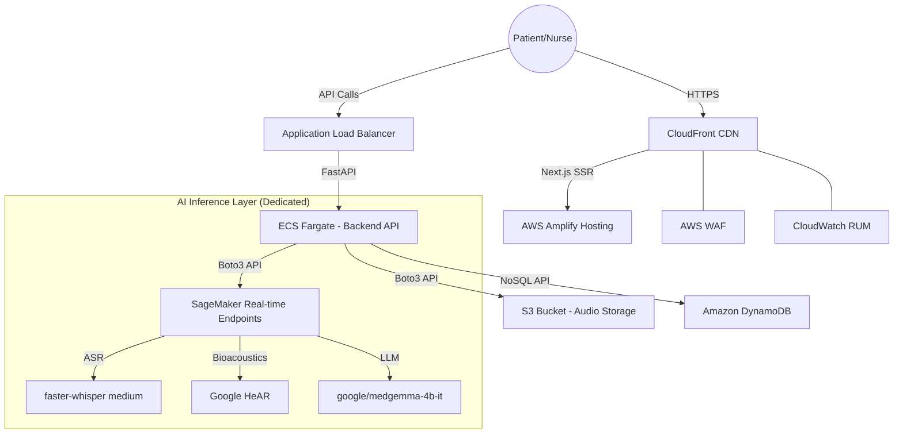

# ☁️ AWS Deployment Plan: VaidyaSaarathi

This plan outlines the migration of the VaidyaSaarathi Agentic Triage system from a local prototype to a production-ready, AWS-native environment.

## 🏗️ Architecture: Dual-Mode Strategy

VaidyaSaarathi is designed to run in two distinct modes to balance development speed with production-grade reliability.

### A. Dev Mode (Local/Prototyping)
Focuses on speed and zero-cost iteration.
- **Storage**: Local Filesystem (`storage/audio`).
- **Database**: In-memory storage/SQLite.
- **Compute**: Local CPU/GPU or single EC2 instance.

### B. Demo/Production Mode (AWS-Native)
A fully decoupled, HIPAA-ready environment where every component is isolated and scalable.

```mermaid
graph TD
    User((Patient/Nurse)) -->|HTTPS| CloudFront[CloudFront CDN]
    CloudFront -->|Next.js SSR| Amplify[AWS Amplify Hosting]
    CloudFront --- WAF[AWS WAF]
    CloudFront --- RUM[CloudWatch RUM]
    
    User -->|API Calls| ALB[Application Load Balancer]
    ALB -->|FastAPI| ECS_Backend[ECS Fargate - Backend API]
    
    ECS_Backend -->|Boto3 API| S3_Audio[S3 Bucket - Audio Storage]
    ECS_Backend -->|NoSQL API| DynamoDB[Amazon DynamoDB]
    
    subgraph "AI Inference Layer (Dedicated)"
        ECS_Backend -->|Boto3 API| SageMaker_Models[SageMaker Real-time Endpoints]
        SageMaker_Models -->|ASR| Whisper[faster-whisper medium]
        SageMaker_Models -->|Bioacoustics| HeAR[Google HeAR]
        SageMaker_Models -->|LLM| MedGemma[google/medgemma-4b-it]
    end
```

## 🛠️ Technical Choice Rationales

| Component | AWS Service | Impactful Rationale |
| :--- | :--- | :--- |
| **Frontend** | **AWS Amplify Hosting** | **Native Next.js Support**: Provides seamless SSR (Server-Side Rendering) which is critical for medical dashboards that need fresh data at every load. Managed CI/CD and atomic deployments ensure zero-downtime updates during clinical shifts. |
| **Backend** | **Amazon ECS Fargate** | **Serverless Operational Excellence**: Moves away from managing EC2 instances. Fargate provides an isolated, HIPAA-eligible compute environment that scales automatically based on triage volume, ensuring clinical staff never experience "server busy" errors. |
| **Database** | **Amazon DynamoDB** | **Predictable Low-Latency**: For critical medical records, DynamoDB offers millisecond-response times at any scale. Its serverless nature means we don't manage a database server, reducing the "blast radius" of maintenance windows. |
| **Storage** | **Amazon S3** | **Durability & Lifecycle**: Clinical audio is non-reproducible patient data. S3 provides 99.999999999% durability. Integrated lifecycle policies allow us to move old audio to Glacier for low-cost, multi-year medical record retention. |
| **AI Model** | **Amazon SageMaker** | **Custom weights for google/medgemma-4b-it**: Bedrock is built for generic LLMs. SageMaker allows us to host specialized medical weights (`google/medgemma-4b-it`) with **dedicated GPU memory**, ensuring the AI reasoning is consistent, private, and deterministic. |

## 🚀 Deployment Workflow

Since we are prioritizing agility and cost-control, we utilize a **Manual CLI-First** deployment strategy, which bypasses CI/CD pipeline costs while maintaining build consistency.

### 2. Frontend Deployment (AWS Amplify)
- **Workflow**: Direct **Git-to-Amplify integration**. Amplify watches your GitHub repository (`client/` monorepo path).
- **Process**: On every `git push`, Amplify automatically pulls changes, runs `npm run build`, and deploys the SSR-optimized application.
- **Environment Variables**: Configure `NEXT_PUBLIC_API_URL` and `NEXT_PUBLIC_AUTH` in the Amplify Console to point to your Production ECS Load Balancer URL.
- **Why?** Completely serverless. No Docker image management, no ECR costs, and zero-maintenance CI/CD.

### 3. Backend Build & Push (`push_backend.sh`)
- Builds a production-optimized Docker image for `linux/amd64`.
- Authenticates with **Amazon ECR** and pushes the `demo` tagged image.
- **Why?** Ensures the EXACT same environment is deployed on ECS as was tested in dev.

## FAQ 

### 1. Why not AWS Bedrock?
VaidyaSaarathi requires the specialized healthcare reasoning of **`google/medgemma-4b-it`**. Bedrock is a third-party model provider API that does not currently support hosting custom domain-expert weights like MedGemma. By using **SageMaker**, we maintain 100% control over the AI's clinical logic and privacy within our VPC.

### 2. What is the Clinical Data Strategy?
VaidyaSaarathi follows a **HIPAA-First Clinical Data Pipeline**:
- **Privacy**: No external APIs (OpenAI/Mistral) are used. PHI remains inside a private AWS VPC.
- **Security**: Data is encrypted at rest via **AWS KMS** and in transit via TLS 1.2+.
- **Observability**: **AWS WAF** protects against web attacks, and **CloudWatch RUM** monitors client-side performance to ensure nurses have a responsive experience.

### 3. What is your "24-hour Goal"?
**Goal**: *Establish the "MedGemma GPU Backbone" on AWS.*
- **Technical Milestone**: Within 24 hours of receiving credits, we will deploy the **`google/medgemma-4b-it` model** to a **SageMaker Real-time Endpoint** and successfully generate a structured SOAP JSON from a test audio file using our hosted ECS/Fargate backend.
- **Impact**: This proves the viability of our 4-tier triage logic on production-grade hardware, reducing SOAP generation latency from ~30s (local) to **<5s (AWS)**.
