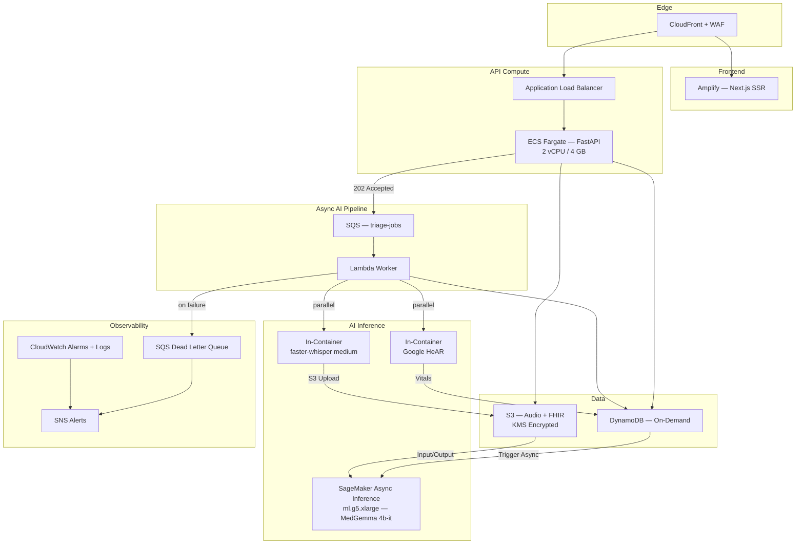
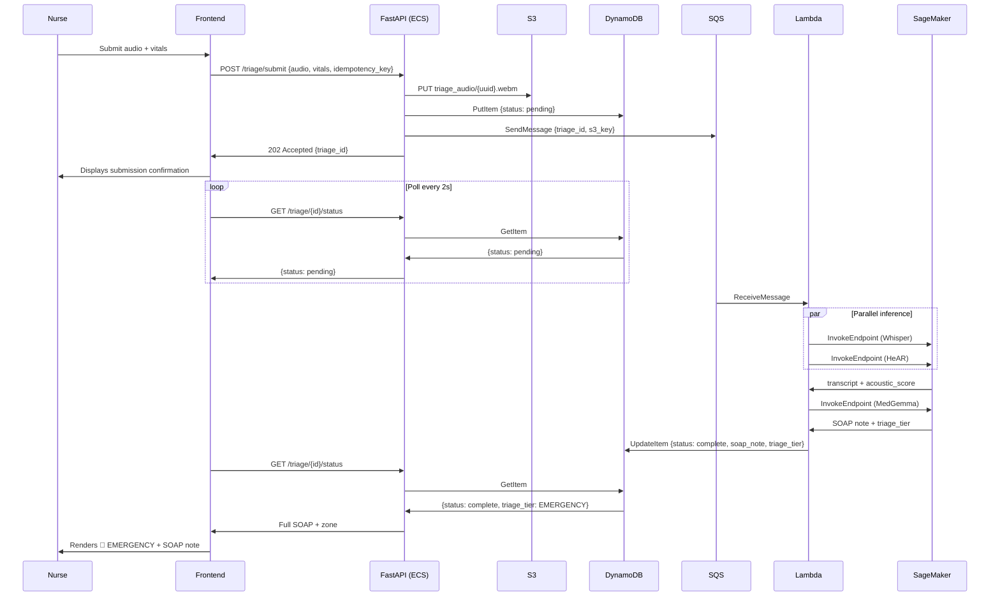
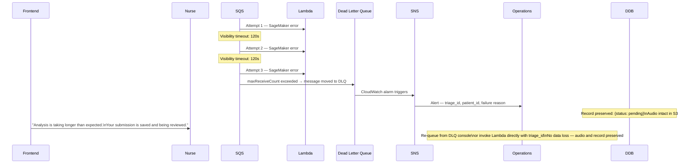

# AWS Deployment Plan: VaidyaSaarathi

VaidyaSaarathi is a clinical triage system that processes patient audio, performs bioacoustic analysis, and generates structured SOAP notes using a multi-model AI pipeline. This document defines the AWS architecture, service selection rationale, operational model, and deployment phases for the system.

---

## Architecture Overview

The system is composed of five logical layers: edge/ingress, frontend, API compute, asynchronous AI inference pipeline, and persistent data storage. All layers are designed for independent scalability and fault isolation.


```mermaid
graph TD
    subgraph "Edge"
        CF[CloudFront + WAF]
    end
    subgraph "Frontend"
        AMP[Amplify — Next.js SSR]
    end
    subgraph "API Compute"
        ALB[Application Load Balancer]
        ECS[ECS Fargate — FastAPI\n2 vCPU / 4 GB]
    end
    subgraph "Async AI Pipeline"
        SQS[SQS — triage-jobs]
        Lambda[Lambda Worker]
    end
    subgraph "AI Inference"
        LOCAL_W[In-Container\nfaster-whisper medium]
        LOCAL_H[In-Container\nGoogle HeAR]
        SM_MG[SageMaker Async Inference\nml.g5.xlarge — MedGemma 4b-it]
    end
    subgraph "Data"
        DDB[DynamoDB — On-Demand]
        S3[S3 — Audio + FHIR\nKMS Encrypted]
    end
    subgraph "Observability"
        DLQ[SQS Dead Letter Queue]
        SNS[SNS Alerts]
        CW[CloudWatch Alarms + Logs]
    end

    CF --> AMP
    CF --> ALB
    ALB --> ECS
    ECS -->|202 Accepted| SQS
    ECS --> DDB
    ECS --> S3
    SQS --> Lambda
    Lambda -->|parallel| LOCAL_W
    Lambda -->|parallel| LOCAL_H
    LOCAL_W -->|S3 Upload| S3
    LOCAL_H -->|Vitals| DDB
    DDB -->|Trigger Async| SM_MG
    S3 -->|Input/Output| SM_MG
    Lambda --> DDB
    Lambda -->|on failure| DLQ
    DLQ --> SNS
    CW --> SNS
```

---

## Service Selection Rationale

| Layer | Service | Rationale |
|---|---|---|
| **Frontend** | AWS Amplify | Native Next.js SSR support with git-integrated CI/CD. Medical dashboards require server-rendered pages to ensure fresh patient data on every load. Atomic deployments eliminate partial rollouts. |
| **API** | ECS Fargate | Containerised FastAPI with no EC2 management overhead. Fargate provides HIPAA-eligible isolated compute. Task-level IAM roles enforce least-privilege access to downstream AWS services. |
| **ASR + Bioacoustics** | In-container (ECS) | faster-whisper and HeAR run within the FastAPI container on CPU. Both models are lightweight enough to operate without dedicated GPU. Keeps the pipeline self-contained and eliminates inter-service network hops for these two steps. |
| **MedGemma 4b-it** | SageMaker Async (ml.g5.xlarge) | SOAP note generation requires the A10G GPU (24 GB VRAM). Asynchronous Inference allows **Scale-to-Zero**, meaning you pay $0.00/hr during idle periods. Automated wake-up handles new requests. |
| **Async Queue** | SQS + Lambda | Decouples audio submission from AI processing. The triage submission endpoint returns immediately (202); Lambda processes the AI pipeline asynchronously. SQS provides at-least-once delivery with built-in retry. |
| **Database** | DynamoDB (On-Demand) | Multi-AZ by default with a 99.999% SLA. On-Demand mode eliminates capacity planning errors and ProvisionedThroughputExceeded failures. Millisecond read latency for triage queue queries. No database server to manage. |
| **Storage** | Amazon S3 | 11-nines durability for non-reproducible patient audio. Lifecycle policies tier old recordings to Glacier for multi-year medical record retention. All access via pre-signed URLs — no public bucket exposure. |
| **Encryption** | AWS KMS (CMK) | Customer-managed key enables per-access CloudTrail audit logging and immediate key revocation if credentials are compromised. Applied to both S3 (SSE-KMS) and DynamoDB (customer-managed CMK). |
| **Edge Security** | CloudFront + WAF | Single HTTPS entry point. WAF enforces OWASP Top 10 rules and a rate limit of 100 requests / 5 minutes per IP on `/api/triage` endpoints to prevent resource abuse. |

---

## AI Inference Pipeline

### Model Configuration

| Model | Deployment | Hardware | Latency (warm) | Rationale |
|---|---|---|---|---|
| **faster-whisper medium** | In-container (ECS Fargate) | CPU (int8) | ~3–5s | int8 quantisation makes it CPU-efficient. Runs inside the FastAPI container; no additional endpoint or network hop required. |
| **Google HeAR** | In-container (ECS Fargate) | CPU | ~2–4s | Lightweight TF SavedModel. No GPU required. Runs in parallel with Whisper within the same Lambda/container execution. |
| **MedGemma 4b-it** | SageMaker Asynchronous Endpoint | ml.g5.xlarge (A10G GPU) | ~4–6s | bfloat16 inference requires GPU VRAM. Async mode enables **Scale-to-Zero** for maximum cost savings. |

### Parallel Execution Model

Whisper (ASR) and HeAR (bioacoustics) are computationally independent and run in parallel. MedGemma is invoked sequentially once both outputs are available.

```
                ┌─→ In-container Whisper (3–5s) ──┐
Audio Input ────┤                                   ├──→ SageMaker MedGemma (4–6s) ──→ SOAP Note
                └─→ In-container HeAR    (2–4s) ──┘

Total latency: ~10–12s (MedGemma warm) | ~3–8 min (Cold Start wake-up)
```

**vs. local sequential execution:** `Whisper (35s) → HeAR (25s) → MedGemma (30s) = 90s`

The reduction is achieved by: (1) A10G GPU acceleration for MedGemma on SageMaker versus local CPU, (2) parallel execution of Whisper and HeAR within the same container, and (3) MedGemma model weights staying resident in GPU VRAM between invocations once the endpoint is warm.

**Implementation in `triage.py`:**
```python
async def run_ai_pipeline(audio_bytes: bytes, language: str, vitals: dict):
    # Whisper and HeAR execute concurrently
    transcript, acoustic = await asyncio.gather(
        invoke_whisper(audio_bytes, language),
        invoke_hear(audio_bytes)
    )
    # MedGemma requires both outputs — sequential
    soap_note = await invoke_medgemma(transcript, acoustic, vitals)
    return transcript, acoustic, soap_note
```

#### Automated Scale-to-Zero (Survival Plan)
An application auto-scaling policy monitors the `ApproximateBacklogSize` metric. When no requests are pending, the instance count is set to **0**.
- **Idle Cost**: $0.00/hour
- **Active Cost**: $1.408/hour (ml.g5.xlarge in ap-south-1)
- **Wake-up Trigger**: The first request uploads to S3, triggering the `has-backlog` alarm and scaling to 1.

---

## Asynchronous Triage Flow

### Two-Phase Response

Triage submission is non-blocking. The system returns a response to the frontend immediately while AI processing runs asynchronously.

```
┌─────────────────────────────────────────────────────────────────────────┐
│  PHASE 1 — Submission (synchronous, completes in <2s)                   │
│                                                                          │
│  → Audio uploaded to S3                                                  │
│  → DynamoDB record created: {status: "pending"}                         │
│  → SQS message enqueued: {triage_id, s3_key, language, patient_id}     │
│  → 202 Accepted returned to frontend with triage_id                     │
│  → Frontend begins polling GET /triage/{id}/status every 2 seconds     │
│                                                                          │
│  PHASE 2 — AI Inference (async, 9–25s)                                  │
│                                                                          │
│  → Lambda worker dequeues SQS message                                   │
│  → Whisper + HeAR invoked in parallel                                   │
│  → MedGemma invoked with transcript + acoustic score                    │
│  → DynamoDB updated: {status: "complete", soap_note, triage_tier}      │
│  → Frontend poll detects "complete" — renders full SOAP output          │
│                                                                          │
│  FALLBACK — Vitals-Only Zone (triggers only if AI > 10s)               │
│                                                                          │
│  → Backend executes deterministic guardrail (_calculate_bucket_triage) │
│    using submitted vitals only (BP, HR, SpO2, temp) — no ML            │
│  → Preliminary triage zone returned to frontend (clearly labelled)     │
│  → Zone updates to AI-derived result when inference completes           │
└─────────────────────────────────────────────────────────────────────────┘
```

### Sequence Diagram — Nominal Path


```mermaid
sequenceDiagram
    participant N as Nurse
    participant FE as Frontend
    participant API as FastAPI (ECS)
    participant S3
    participant DDB as DynamoDB
    participant SQS
    participant L as Lambda
    participant SM as SageMaker

    N->>FE: Submit audio + vitals
    FE->>API: POST /triage/submit {audio, vitals, idempotency_key}
    API->>S3: PUT triage_audio/{uuid}.webm
    API->>DDB: PutItem {status: pending}
    API->>SQS: SendMessage {triage_id, s3_key}
    API->>FE: 202 Accepted {triage_id}
    FE->>N: Displays submission confirmation

    loop Poll every 2s
        FE->>API: GET /triage/{id}/status
        API->>DDB: GetItem
        DDB->>API: {status: pending}
        API->>FE: {status: pending}
    end

    SQS->>L: ReceiveMessage
    par Parallel inference
        L->>SM: InvokeEndpoint (Whisper)
        L->>SM: InvokeEndpoint (HeAR)
    end
    SM->>L: transcript + acoustic_score
    L->>SM: InvokeEndpoint (MedGemma)
    SM->>L: SOAP note + triage_tier
    L->>DDB: UpdateItem {status: complete, soap_note, triage_tier}

    FE->>API: GET /triage/{id}/status
    API->>DDB: GetItem
    DDB->>API: {status: complete, triage_tier: EMERGENCY}
    API->>FE: Full SOAP + zone
    FE->>N: Renders 🔴 EMERGENCY + SOAP note
```

### Sequence Diagram — Inference Failure Path


```mermaid
sequenceDiagram
    participant FE as Frontend
    participant N as Nurse
    participant SQS
    participant L as Lambda
    participant DLQ as Dead Letter Queue
    participant SNS
    participant OPS as Operations

    SQS->>L: Attempt 1 — SageMaker error
    Note over SQS: Visibility timeout: 120s
    SQS->>L: Attempt 2 — SageMaker error
    Note over SQS: Visibility timeout: 120s
    SQS->>L: Attempt 3 — SageMaker error
    SQS->>DLQ: maxReceiveCount exceeded → message moved to DLQ
    DLQ->>SNS: CloudWatch alarm triggers
    SNS->>OPS: Alert — triage_id, patient_id, failure reason

    Note over DDB: Record preserved: {status: pending}\nAudio intact in S3
    FE->>N: "Analysis is taking longer than expected.\nYour submission is saved and being reviewed."

    Note over OPS: Re-queue from DLQ console\nor invoke Lambda directly with triage_id\nNo data loss — audio and record preserved
```

**There is no silent degraded fallback.** Inference failures are surfaced immediately to operations via SNS, with all patient data preserved in S3 and DynamoDB for reprocessing.

---

## SQS Configuration

| Parameter | Value | Reason |
|---|---|---|
| Queue type | Standard | High throughput, at-least-once delivery |
| Visibility Timeout | 120s | Exceeds maximum expected inference time (25s + buffer) |
| Message Retention | 4 hours | Allows time for ops intervention on failures |
| Max Receive Count | 3 | Three attempts before DLQ routing |
| Dead Letter Queue | Enabled | Captures permanently failed jobs for reprocessing |

---

## Data Layer

### DynamoDB — Table Design

```
Table: vaidyasaarathi-triage
  Partition Key: id (UUID)       ← uniform write distribution
  
  GSI-1: status-created-index
    Partition Key: status         ← pending | processing | complete | failed
    Sort Key: created_at
    Purpose: Triage queue queries (replaces table.scan())

  GSI-2: patient-history-index
    Partition Key: patient_id
    Sort Key: created_at
    Purpose: Per-patient triage history

Table: vaidyasaarathi-patients
  Partition Key: id (UUID)

Configuration:
  Billing mode: PAY_PER_REQUEST (on-demand)
  Point-in-Time Recovery: enabled (35-day restore window)
  Encryption: AWS_OWNED_CMK
```

**DynamoDB vs. RDS for this workload:**

| Concern | RDS PostgreSQL | DynamoDB |
|---|---|---|
| Availability | Single-AZ: single point of failure | Multi-AZ by default, 99.999% SLA |
| Operational overhead | Patches, backups, parameter groups, vacuum | Zero operational overhead |
| Failure handling | DB crash = application down | Transparent failover, no client changes |
| Scaling | Requires capacity planning | Auto-scales with no configuration |
| Cost at demo scale | db.t3.micro ~$15/month | On-demand < $1/month at demo traffic |

**DynamoDB failure mitigation:**
- S3 upload completes before DynamoDB write. If PutItem fails, audio is not lost; the API returns 503 and the frontend prompts a retry.
- Lambda write failures use exponential backoff (most throttling errors resolve within 1–2s).
- PITR enables point-in-time restore to any second within the last 35 days.

### S3 — Bucket Structure and Encryption

```
vaidyasaarathi-audio-{account_id}
  triage_audio/{year}/{month}/{day}/{uuid}_{filename}.webm
  Encryption: SSE-KMS (Customer Managed Key)
  Block Public Access: all settings enabled
  Pre-signed URL expiry: 3600s

vaidyasaarathi-fhir-{account_id}
  bundles/{patient_id}/{bundle_id}.json
  Encryption: SSE-KMS (same CMK)
  Pre-signed URL expiry: 900s

Lifecycle policy (vaidyasaarathi-audio):
  0–30 days:   S3 Standard
  30–365 days: S3 Intelligent-Tiering
  365+ days:   S3 Glacier Deep Archive
  7 years:     Expiration (medical record retention compliance)
```

---

## Security

### HIPAA Eligibility Requirements

| Control | Status | Implementation |
|---|---|---|
| Data encrypted at rest | ✅ | S3 SSE-KMS + DynamoDB CMK |
| Data encrypted in transit | ✅ | CloudFront enforces TLS 1.2 minimum |
| No PHI to external services | ✅ | All AI inference on private AWS account (SageMaker). No OpenAI / third-party LLM calls. |
| Access logging | ✅ | S3 server access logs + CloudTrail for KMS API calls |
| IAM least privilege | ⬜ | Replace `AmazonSageMakerFullAccess` and `AmazonS3FullAccess` with scoped inline policies scoped to specific resource ARNs |
| Business Associate Agreement | ⬜ | Required before handling real patient data |

### IAM Task Role (Production Target)

```json
{
  "Effect": "Allow",
  "Action": [
    "sagemaker:InvokeEndpoint",
    "s3:GetObject", "s3:PutObject",
    "dynamodb:GetItem", "dynamodb:PutItem",
    "dynamodb:UpdateItem", "dynamodb:Query",
    "secretsmanager:GetSecretValue"
  ],
  "Resource": [
    "arn:aws:sagemaker:ap-south-1:ACCOUNT:endpoint/vaidyasaarathi-*",
    "arn:aws:s3:::vaidyasaarathi-audio-ACCOUNT/*",
    "arn:aws:dynamodb:ap-south-1:ACCOUNT:table/vaidyasaarathi-*"
  ]
}
```

### Authentication

**Demo environment:** Credential-based login via `server/api/auth.py`. Appropriate for controlled demo access with known users.

**Production migration — AWS Cognito:**
```
User Pool: vaidyasaarathi-users
  Groups:
    nurse-group    → create and update triage records
    doctor-group   → read triage queue, finalize SOAP notes
    admin-group    → full access

  MFA: TOTP (required)
  Federation: SAML 2.0 / OIDC (hospital SSO, Phase 2)

FastAPI:
  JWT validated per-request via aws-cognito-jwt-auth
  user.sub → user_id | user.groups → role-based access
```

### Secrets Management

Sensitive values (HuggingFace token, SageMaker endpoint names) are stored in environment variables or `terraform.tfvars` for the demo environment. Before production use with real patient data, these must be migrated to AWS Secrets Manager and injected into ECS Task Definitions as `secrets` references.

```bash
# Production migration
aws secretsmanager create-secret \
  --name "vaidyasaarathi/hf-token" \
  --secret-string "<value>"
```

---

## Networking

### Demo Environment
Default VPC with public subnets. Adequate for controlled demo access.

### Production Target VPC
```
VPC CIDR: 10.0.0.0/16  (ap-south-1, 3 AZs)

Public subnets:    10.0.1–3.0/24   → ALB only
Private subnets:   10.0.11–13.0/24 → ECS Fargate, Lambda
Isolated subnets:  10.0.21–23.0/24 → SageMaker endpoints

VPC Gateway Endpoints (no data transfer cost):
  → com.amazonaws.ap-south-1.s3
  → com.amazonaws.ap-south-1.dynamodb

VPC Interface Endpoints (eliminates NAT Gateway egress cost):
  → com.amazonaws.ap-south-1.sagemaker.runtime
  → com.amazonaws.ap-south-1.secretsmanager
  → com.amazonaws.ap-south-1.ecr.api / ecr.dkr
```

---

## Observability

### CloudWatch Alarms

| Alarm | Threshold | Action |
|---|---|---|
| SQS DLQ visible messages | > 0 | SNS → Email (triage job permanently failed) |
| ECS running task count | < 2 for 2 min | SNS alert (API degraded) |
| SageMaker invocation 5xx errors | > 2 per minute | SNS alert |
| Lambda duration | > 90s | SNS alert (inference pipeline stalled) |
| S3 4xx errors | > 5 per minute | SNS alert (pre-signed URL access failure) |

### Structured Logging

All service logs emit JSON-structured entries, enabling CloudWatch Logs Insights queries:

```python
logger.info(json.dumps({
    "event": "triage_complete",
    "triage_id": triage_id,
    "zone": final_tier,
    "whisper_latency_s": whisper_time,
    "hear_latency_s": hear_time,
    "medgemma_latency_s": medgemma_time
}))
```

**Sample Insights query — EMERGENCY triage events:**
```sql
fields @timestamp, triage_id, zone
| filter event = "triage_complete" and zone = "EMERGENCY"
| sort @timestamp desc
```

---

## Cost Analysis

### 12-Day Demo Budget (ap-south-1 pricing, March 2026)

| Service | Configuration | Daily | 12-Day Total |
|---|---|---|---|
| ECS Fargate | 1 task (FastAPI + Whisper + HeAR in-container), 12 hrs/day | $0.40 | $4.80 |
| SageMaker Async | ml.g5.xlarge — 100% Scale-to-Zero | $0.00* | ~$5.00 |
| ALB | 1 load balancer | $0.60 | $7.20 |
| CloudFront + WAF | < 1M requests | $0.10 | $1.20 |
| Amplify Hosting | Build + SSR | $0.10 | $1.20 |
| DynamoDB On-Demand | ~10K operations/day | $0.05 | $0.60 |
| S3 | ~1 GB audio/day | $0.10 | $1.20 |
| Lambda | ~100 invocations/day | $0.02 | $0.24 |
| CloudWatch | Logs + alarms | $0.20 | $2.40 |
| **Total** | | **~$1.57/day** | **~$19 (12 days)** |

### MedGemma Real-Time Endpoint Cost Model

```
Instance: ml.g5.xlarge
On-demand rate: $1.408/hr (ap-south-1)

Scheduled operation (Automated Scale-to-Zero):
  Average usage (1 hr/day active) = $1.408/day
  Idle time (23 hrs/day) = $0.00/day
  Total: ~$1.41/day
  Saving vs Real-Time: **~$32.38/day saved**
```

> **Note:** GPU compute for MedGemma is the dominant cost driver (~91% of total). Use AWS credits to cover this. The endpoint is the exact confirmed-working configuration — no changes to model, container, or instance type.

---

## Deployment Phases

### Phase 1 — Demo (Current)

| Component | Configuration |
|---|---|
| Authentication | Demo credential login (`auth.py`) |
| AI Inference | SageMaker Asynchronous ml.g5.xlarge (MedGemma) + Whisper/HeAR in-container |
| Backend | ECS Fargate single task |
| Async pipeline | SQS + Lambda |
| Networking | Default VPC |
| Monitoring | DLQ alarm → SNS email |

### Phase 2 — Pilot Deployment

| Addition | Justification |
|---|---|
| AWS Cognito | Role-based access for real clinical users |
| Custom VPC + private subnets | HIPAA network isolation requirement |
| DynamoDB GSIs | Query performance at scale (replace `.scan()`) |
| KMS CMK + CloudTrail | Full audit trail for PHI access |
| IAM scoped inline policies | Least-privilege production hardening |
| X-Ray distributed tracing | End-to-end latency visibility across services |

### Phase 3 — Production Scale

| Addition | Justification |
|---|---|
| Dedicated Whisper/HeAR SageMaker endpoints | At > 500 triages/day, in-container CPU inference becomes a bottleneck; move to dedicated GPU endpoints for sub-2s transcription |
| Multi-AZ ECS (min 2 tasks across AZs) | Active-active HA; ALB drains unhealthy tasks transparently |
| ElastiCache Redis | Session cache to reduce DynamoDB read pressure on the triage queue endpoint |
| AWS Backup cross-region | DynamoDB and S3 replication to a secondary region for disaster recovery |
| PWA offline capability | Low-bandwidth / offline support for rural primary health centres |

---

## Backend Build and Push

```bash
# Build production Docker image (linux/amd64)
./push_backend.sh

# Workflow:
# 1. docker buildx build --platform linux/amd64
# 2. aws ecr get-login-password | docker login
# 3. docker push <account>.dkr.ecr.ap-south-1.amazonaws.com/vaidyasaarathi-api:demo
# 4. aws ecs update-service --force-new-deployment
```

Frontend deploys automatically on `git push` to `main` via Amplify's GitHub integration (monorepo path: `client/`).

---

## Why Not AWS Bedrock?

VaidyaSaarathi requires `google/medgemma-4b-it` — a domain-specific medical language model with healthcare-tuned weights. Amazon Bedrock provides access to general-purpose foundation models from third-party providers and does not support hosting custom model weights. SageMaker allows deployment of any container-packaged model with full control over inference configuration, privacy (data never leaves the AWS account), and determinism.

---

*Pricing references: AWS ap-south-1 on-demand rates, March 2026. SageMaker Serverless Inference: $0.00008/GB-second. ECS Fargate: $0.04048/vCPU-hour, $0.004445/GB-hour.*
