# Tele-Triage (Agentic AI for Healthcare)

### "Hearing the Unheard: An Agentic AI that Listens, Reasons, and Triage’s for Billion-Scale Healthcare."

___

India faces a staggering doctor-patient ratio of 1:834 (well below WHO standards). In rural telemedicine and crowded OPDs, two critical bottlenecks exist:

Triage Overload: Nurses manually screen thousands of calls, often missing subtle distress signals due to volume and fatigue.
Documentation Burnout: Doctors spend ~50% of their time typing SOAP notes instead of treating patients.

___

**Tele-Triage** is an Agentic AI System that acts as a "Level 1 Clinical Assistant." It sits between the patient and the doctor, automating the intake-to-documentation pipeline before the consultation even begins.

Unlike standard chatbots, Tele-Triage is Multi-Modal and Agentic:

It Listens (Acoustic Analysis): Using heuristics inspired by Google's HeAR, it analyzes audio waveforms to detect respiratory distress (e.g., cough intensity, breathing patterns).

It Reasons (Medical LLM): Powered by MedGemma 4B (local inference), it understands complex medical history and symptoms.

It Acts (Documentation): It autonomously drafts professional SOAP Notes and flags high-risk cases for immediate attention.

---

## 🏥 Healthcare Impact
This project directly addresses **two critical crises** in modern healthcare:

1.  **Clinician Burnout**: Doctors spend up to **50% of their day** on EHR documentation (SOAP notes). Tele-Triage automates this, returning hours to patient care.
2.  **Triage Bottlenecks**: In tele-health, nurses manually screen thousands of calls. Our "Agentic Workflow" acts as a **Level 1 Triage Agent**, autonomously flagging high-risk patients (e.g., detecting respiratory distress via cough sounds).


---

## How It Works (Technical Excellence)
We built a privacy-first, hybrid AI architecture:

Input: Patient speaks naturally (voice) via the Next.js frontend.

Perception Layer:
ASR: Whisper converts speech to text, handling diverse accents.
Bio-Acoustics: Python librosa extracts signal energy and zero-crossing rates to quantify "respiratory distress" (simulating HeAR capabilities).

Reasoning Layer:
MedGemma 4B (via Ollama) ingests the transcript + acoustic risk scores.
It synthesizes a structured clinical summary and assigns a Triage Priority Level.
Output: The Doctor Dashboard (FastAPI) presents a prioritized queue, ensuring critical patients are seen first.
---

---
## 🏗️ High-Level Architecture

```mermaid
graph TD
    %% Users
    Patient(["👤 Patient"])
    Doctor(["👨‍⚕️ Doctor"])

    %% Frontend
    subgraph Frontend [Next.js Client]
        P_Portal["Patient Portal"]
        D_Portal["Doctor Dashboard"]
    end

    %% Backend
    subgraph Backend [FastAPI Server]
        Router["API Router"]
        
        subgraph Processing [AI Processing Pipeline]
            Whisper["🗣️ Whisper ASR<br/>(Speech-to-Text)"]
            Librosa["🌊 Acoustic Analysis<br/>(Breathing/Cough Detection)"]
            MedGemma["🧠 MedGemma 4B<br/>(Clinical Reasoning)"]
        end
    end

    %% External/Local Service
    Ollama["🦙 Ollama Local Inference"]

    %% Connections
    Patient -->|Voice/Symptom Input| P_Portal
    P_Portal -->|Audio Data| Router
    
    Router --> Whisper
    Router --> Librosa
    
    Whisper -->|Transcript| MedGemma
    Librosa -->|Acoustic Biomarkers| MedGemma
    
    MedGemma <-->|Llama 3/Gemma Weights| Ollama
    
    MedGemma -->|SOAP Note & Triage Score| D_Portal
    D_Portal -->|Review & Action| Doctor
    
    classDef user fill:#e1f5fe,stroke:#01579b,stroke-width:2px;
    classDef component fill:#f3e5f5,stroke:#4a148c,stroke-width:2px;
    classDef ai fill:#fff3e0,stroke:#e65100,stroke-width:2px;
    
    class Patient,Doctor user;
    class P_Portal,D_Portal,Router component;
    class Whisper,Librosa,MedGemma,Ollama ai;
```



---

## ⚙️ Technical Architecture

### **Hybrid AI Stack**
-   **Reasoning Engine**: `MedGemma 4B` (running locally via **Ollama**).
    -   *Why?* Ensures medical domain accuracy and data privacy (local inference).
-   **ASR (Speech-to-Text)**: `Whisper` (via Python Transformers).
    -   *Why?* Robust handling of medical terminology in speech.
-   **Acoustic Analysis**: Python `librosa` based heuristics (Simulating **HeAR**).
    -   *Why?* Measures signal energy and zero-crossing rates to flag "Abnormal Respiratory Sounds".

### **Stack**
-   **Frontend**: Next.js 14, Tailwind CSS (Patient & Doctor Portals).
-   **Backend**: Python FastAPI.
-   **Deployment**: Fully local (Privacy-first).

---

## 🚀 How it Works
1.  **Patient Interface**: Exploring the "Patient" mode, a user speaks naturally about their symptoms.
2.  **Multi-Modal Analysis**:
    -   The backend extracts the *text transcript*.
    -   It simultaneously analyzes *audio waveforms* for distress signals.
3.  **Agentic Reasoning**:
    -   MedGemma receives the transcript + acoustic risk score.
    -   It synthesizes a **SOAP Note** (Subjective, Objective, Assessment, Plan).
4.  **Doctor Interface**: The clinician sees a sorted queue. High-risk inputs (acoustic or clinical) are prioritized.

---

## 🛠️ Setup Instructions

### Prerequisites
-   Node.js & npm
-   Python 3.10+
-   **Ollama** (for MedGemma)
-   **FFmpeg** (for Audio processing)

### Quick Start

1.  **Start AI Server (Ollama)**
    ```bash
    ollama run medgemma
    ```

2.  **Start Backend**
    ```bash
    cd server
    python3 -m venv venv
    source venv/bin/activate
    pip install -r requirements.txt
    uvicorn main:app --reload --port 8000
    ```

3.  **Start Frontend**
    ```bash
    cd client
    npm run dev
    # Visit http://localhost:3000
    ```
