# Tele-Triage (Clinical Workflow Assistant)

### "Hearing the Unheard: An Agentic AI that Listens, Reasons, and Supports Triage for Billion-Scale Healthcare."


___

> **⚠️ DISCLAIMER:** Tele-Triage is a workflow optimization tool designed to Assist clinicians, NOT replace them. It provides triage suggestions based on acoustic and textual analysis. It does NOT provide medical diagnoses. In case of emergency, standard protocols must be followed.

___

India faces a staggering doctor-patient ratio of 1:834 (well below WHO standards). In rural telemedicine and crowded OPDs, two critical bottlenecks exist:

1.  **Triage Overload**: Nurses manually screen thousands of calls, often missing subtle distress signals due to volume and fatigue.
2.  **Documentation Burnout**: Doctors spend ~50% of their time typing SOAP notes instead of treating patients.

___

**Tele-Triage** is an Agentic AI System that acts as a "Level 1 Clinical Assistant." It sits between the patient and the doctor, automating the intake-to-documentation pipeline before the consultation even begins.

Unlike standard chatbots, Tele-Triage is Multi-Modal and Agentic:

1.  **It Listens (Acoustic Screening)**: Using heuristics inspired by Google's HeAR, it screens audio waveforms to **flag** potential respiratory distress (e.g., cough intensity, breathing patterns) for human review.
2.  **It Reasons (Medical LLM)**: Powered by MedGemma 4B (local inference), it structures complex patient history into clinical notes.
3.  **It Supports (Documentation)**: It autonomously drafts professional SOAP Notes and suggests a Triage Priority Level for the doctor to approve.

## Demo

[](https://www.youtube.com/watch?v=0F5j3puTxPI)

---

## 🏥 Healthcare Impact
This project directly addresses **two critical crises** in modern healthcare:

1.  **Clinician Burnout**: Doctors spend up to **50% of their day** on EHR documentation (SOAP notes). Tele-Triage automates this draft, returning hours to patient care.
2.  **Triage Efficiency**: In tele-health, nurses manually screen thousands of calls. Our "Agentic Workflow" acts as a **Level 1 Triage Assistant**, autonomously prioritizing high-risk patients based on reported symptoms and acoustic markers.

---

## 🛡️ Safety & Limitations
We prioritize responsible AI deployment. This system is designed with specific guardrails:

1.  **Not a Diagnostic Tool**: The system provides **suggestions** for triage priority. It does NOT diagnose diseases. All outputs require clinician validation.
2.  **Privacy First**: All inference (Audio & LLM) runs **locally** on the device/server. No patient data is sent to external clouds, ensuring compliance with data privacy standards.

---

## Technical Architecture (Privacy-First)

### **Hybrid AI Stack**
-   **Reasoning Engine**: `MedGemma 4B` (running locally via **Ollama**).
    -   *Why?* Ensures medical domain accuracy and data privacy (local inference).
-   **ASR (Speech-to-Text)**: `Whisper` (via Python Transformers).
    -   *Why?* Robust handling of medical terminology and diverse accents.
-   **Acoustic Screening**: Python `librosa` based heuristics.
    -   *Why?* Measures signal energy to **flag** "Abnormal Respiratory Sounds" for doctor review.

### **Stack**
-   **Frontend**: Next.js 14, Tailwind CSS (Patient & Doctor Portals).
-   **Backend**: Python FastAPI.
-   **Deployment**: Fully local (Privacy-first).

---

## 🚀 How it Works
1.  **Patient Interface**: Patient speaks naturally about their symptoms.
2.  **Multi-Modal Analysis**:
    -   The backend extracts the *text transcript*.
    -   It simultaneously scans *audio waveforms* for high-energy events (potential distress).
3.  **Agentic Reasoning**:
    -   MedGemma receives the transcript + acoustic flags.
    -   It drafts a **SOAP Note** (Subjective, Objective, Assessment, Plan).
4.  **Clinician Review**: The doctor sees a prioritized queue. High-risk inputs are flagged. The doctor **reviews and edits** the note before finalizing.

---

## 🏗️ High-Level Architecture

```mermaid
graph TD
    %% Users
    Patient(["👤 Patient"])
    Doctor(["👨‍⚕️ Doctor"])

    %% Frontend
    subgraph Frontend [Next.js Client]
        P_Portal["Patient Portal"]
        D_Portal["Doctor Dashboard"]
    end

    %% Backend
    subgraph Backend [FastAPI Server]
        Router["API Router"]
        
        subgraph Processing [AI Processing Pipeline]
            Whisper["🗣️ Whisper ASR<br/>(Speech-to-Text)"]
            Librosa["🌊 Acoustic Screening<br/>(Signal Energy Heuristics)"]
            MedGemma["🧠 MedGemma 4B<br/>(Clinical Reasoning)"]
        end
    end

    %% External/Local Service
    Ollama["🦙 Ollama Local Inference"]

    %% Connections
    Patient -->|Voice/Symptom Input| P_Portal
    P_Portal -->|Audio Data| Router
    
    Router --> Whisper
    Router --> Librosa
    
    Whisper -->|Transcript| MedGemma
    Librosa -->|Acoustic Flags| MedGemma
    
    MedGemma <-->|Llama 3/Gemma Weights| Ollama
    
    MedGemma -->|Draft SOAP & Priority| D_Portal
    D_Portal -->|Review & Approve| Doctor
    
    classDef user fill:#e1f5fe,stroke:#01579b,stroke-width:2px;
    classDef component fill:#f3e5f5,stroke:#4a148c,stroke-width:2px;
    classDef ai fill:#fff3e0,stroke:#e65100,stroke-width:2px;
    
    class Patient,Doctor user;
    class P_Portal,D_Portal,Router component;
    class Whisper,Librosa,MedGemma,Ollama ai;
```



---

## 🛠️ Setup Instructions

### Prerequisites
-   Node.js & npm
-   Python 3.10+
-   **Ollama** (for MedGemma)
-   **FFmpeg** (for Audio processing)

### Quick Start

1.  **Start AI Server (Ollama)**
    ```bash
    ollama run medgemma
    ```

2.  **Start Backend**
    ```bash
    cd server
    python3 -m venv venv
    source venv/bin/activate
    pip install -r requirements.txt
    uvicorn main:app --reload --port 8000
    ```

3.  **Start Frontend**
    ```bash
    cd client
    npm run dev
    # Visit http://localhost:3000
    ```
